# Workshop prog algo - Agathe OLIVIER

## Exercice n°1 : Ne garder que le vert

Mettre le bleu et le rouge à 0.


## Exercice n°2 : Échanger les canaux

Avec swap.


## Exercice n°3 : Noir et blanc 

Grace à la formule de luminance (rouge*0.3 + vert*0.59 + bleu*0.11)


## Exercice n°4 : Négatif

1-couleur pour avoir l'inverse.


## Exercice n°5 : Dégradé

Equivalent de map en Processing puis (gris, gris, gris) pour les couleurs.


## Exercice n°6 : Inverse

Au départ je n'avais pas stocker l'image de référence, et j'obtenais une symétrie.


## Exercice n°7 : Bruits

30% de chance que le pixel soit remplacé par une couleur aléatoire.

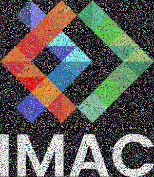

## Exercice n°8 : Rotation 90°

J'ai eu un peu de mal à comprendre la formule pour la rotation à 90, j'ai donc fait un schéma sur papier pour mieux comprendre ce qui se passait :

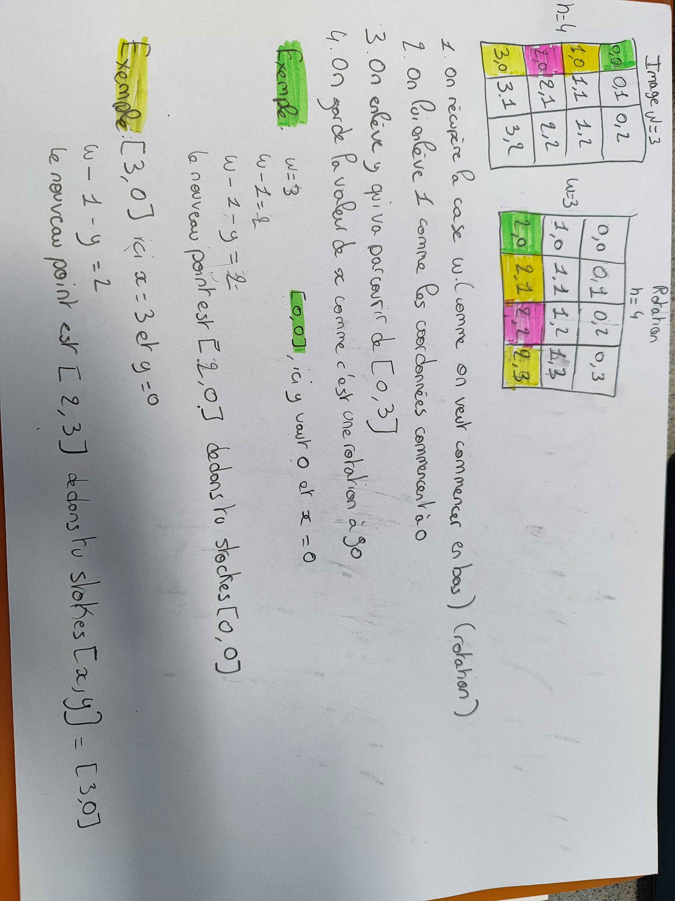

J'ai donc obtenu le bon résultat : 


## Exercice n°9 : RGB Split

J'ai eu du mal à trouver les conditions dans les if, au départ je gardais les pixels de base mais ça faisait un bord à l'effet.

J'ai compris grace à mes camarades qu'il fallait retirer le rouge ou le bleu en fonction du bord.

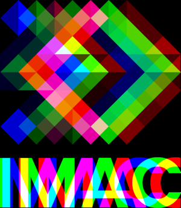

## Exercice n°10 : Luminosité

Puissance 1,5 pour assombrir et puissance 0,5 pour éclairer.


## Exercice n°11 : Disque

On a un cercle qui a pour centre le point [cx, cy] et pour rayon R. 
L'équation de la droite est :

>(x−cx)² + (y−cy)² ≤ R²

Si (x−cx)² + (y−cy)² < R² alors le point est à l’intérieur du disque.
Si (x−cx)² + (y−cy)² = R² alors le point est sur le contour
Si (x−cx)² + (y−cy)² > R² alors le point est à l’extérieur


### Partie 2 : cercle

Le plus gros problème a été les maths (aled 🥲), heurement les camarades m'ont expliqué la formule : 
>(R−e)² ≤ (x−cx)² + (y−cy)² ≤ R²

La deuxième difficulté a été de comprendre qu'il fallait séparer la condition en 2, sinon on obtient une image toute blanche.

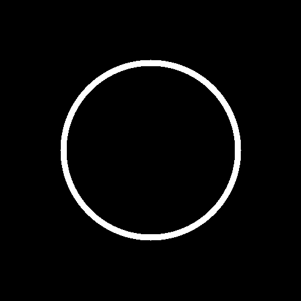

### Partie 2 : Animation

25 images pour le GIF.


### Partie 3 : Rosace

Le plus gros problème : les maths 🥲
Les formules : 
>Point de départ X = Centre de l'image + rayon * cos(z * π / 3)

>Point de départ Y = Centre de l'image + rayon * sin(z * π / 3)

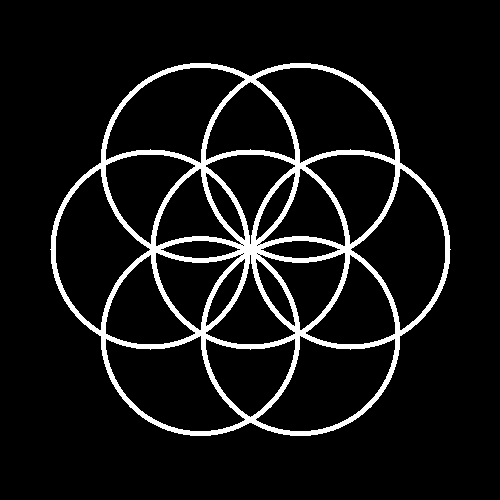

## Exercice n°12 : Mosaïque

J'ai fait un premier test où le décalage était mal pensé, mais le résultat intéressant donc je l'ai sauvegardé dans "joliFail" :

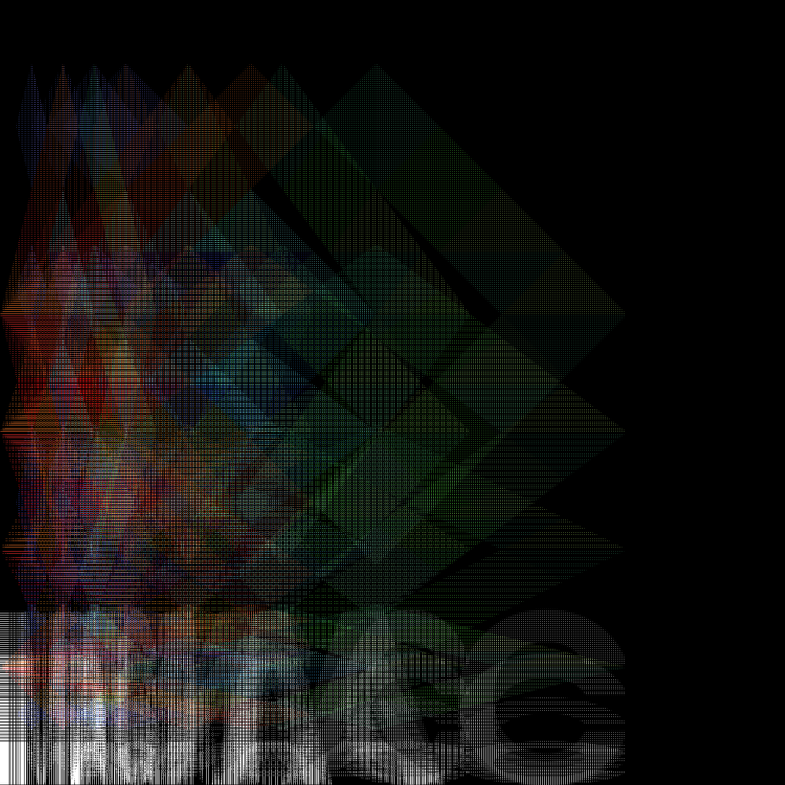

J'ai réajusté le problème de décalage pour obtenir le bon résultat : 

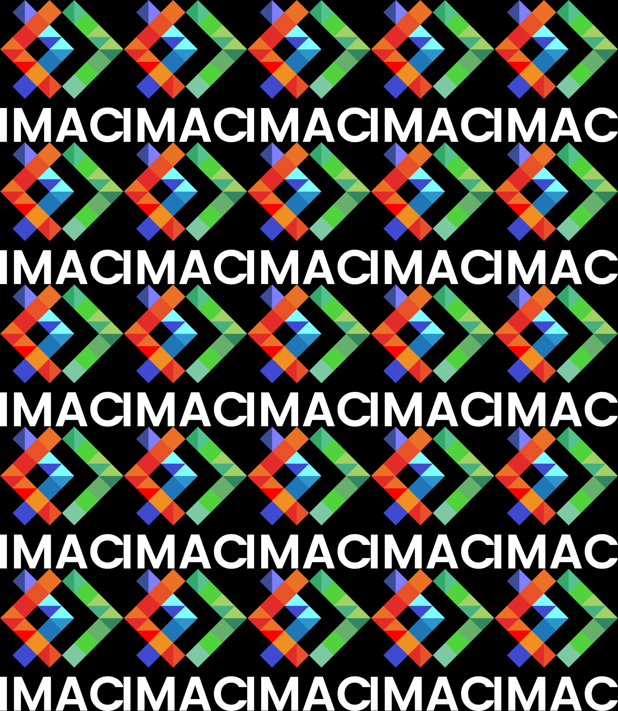

### Partie 2 : Mosaïque inversée

J'ai commencé par définir 4 les formes possibles de l'image et à quel moment elle était affiché : 

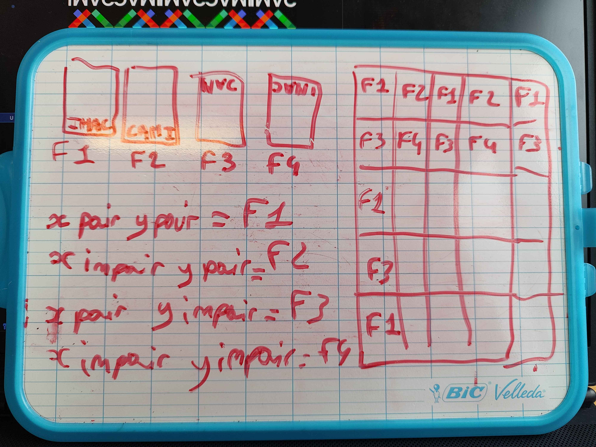

Il m'a suffit ensuite de le retranscrire en code pour obtenir le résultat :

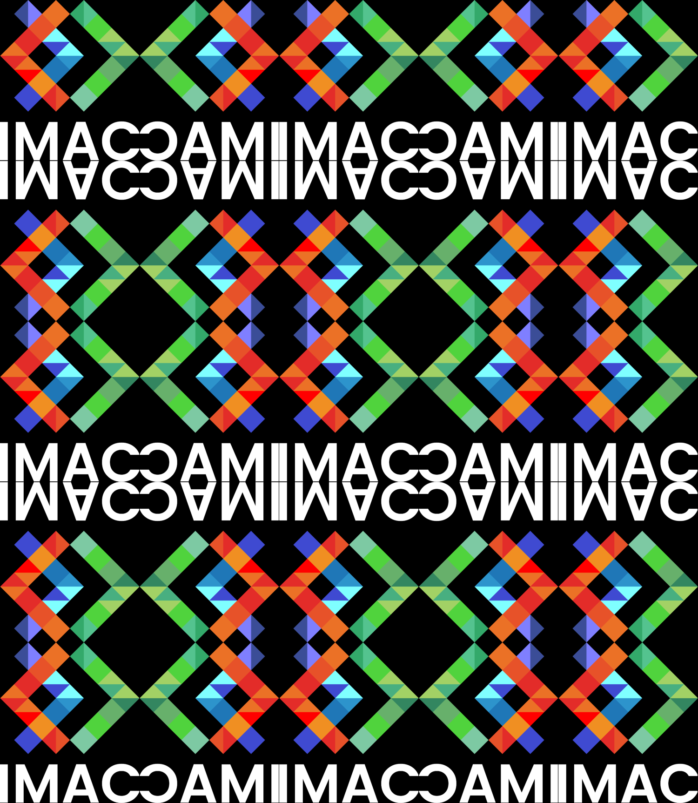

## Exercice n°13 : Glitch

Le seul problème que j'ai rencontré est que ma condition dans le if n'était pas bonne, donc j'avais un glitch de point plutôt qu'un glitch de rectangle. Une fois la condition vérifié, j'ai le résultat suivant :


## Exercice n°14 : Tri de pixels

Sur chaque ligne, en portion d'une longueur et d'une position aléatoire et triée.

Le problème le plus dur était de comprendre comment obtenir l'index de départ et de fin de la portion triée dans le tableau comme il n'est pas en double entrée.

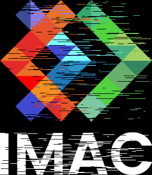

## Exercice n°15 : Fractale de Mandelbrot

La plus grosse difficulté a été de réussir à convertir l'intervalle.

Pour le dégradé de blanc, j'ai d'abord obtenu ce résultat avant de trouver le bon calcule.

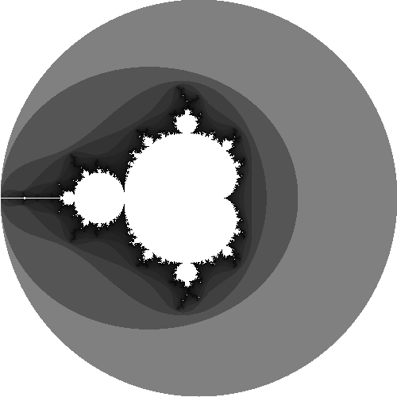
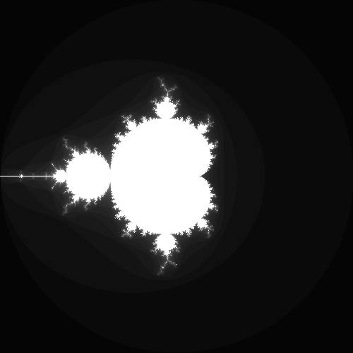

## Exercice n°16 : Dégradé

Le dégradé en suivant le même principe qu'au début :

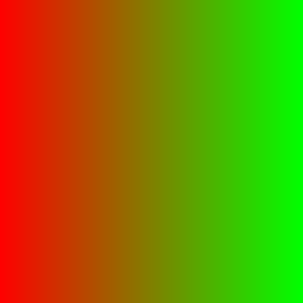

Je les refais en OK Lab (le plus dur était la conversion de sRGB vers Linéar), et aussi la structure lab dans la doc qui au finale n'est pas utilisable avec glm::mix.

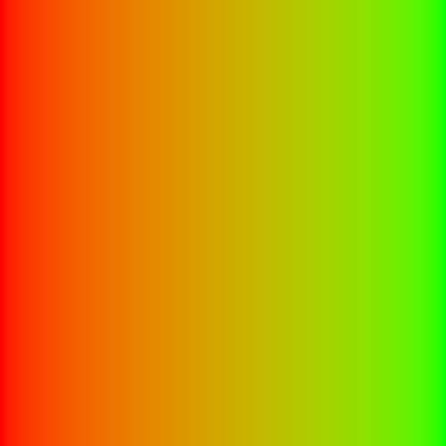

## BONUS : Arc-en-ciel (stp ça mérite un point bonus 🥺)

Je me suis dis qu'un arc-en-ciel suivait le même principe qu'un dégradé. Avec quelque cherche, j'ai découvert qu'on pouvait découper l'arc-ciel en segment d'une couleur à l'autre, puis d'appliquer les dégradés sur ces segments.

J'ai choisi de stocker les 7 couleurs dans un tableau pour pouvoir y accéder facilement via un ID et éviter plein de boucle if.

La plus grosse difficulté est de trouver sur quel segment on se trouve, et la position sur ce segment pour déterminer la couleur actuelle.

Après quelques ajustements, j'ai obtenu cet arc-en-ciel :

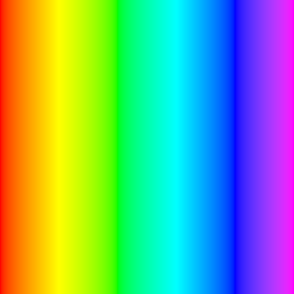

## Exercice n°17 : Tramage

La difficulté était de trouver les bonnes valeurs et de penser à passer en noir et blanc.


## Exercice n°18 : Normalisation de l'histogramme

La difficulté était de trouver la formule : 

```image.pixel(x,y).g = (image.pixel(x,y).g - minimum) * (1 - 0)/(maximum - minimum);```


